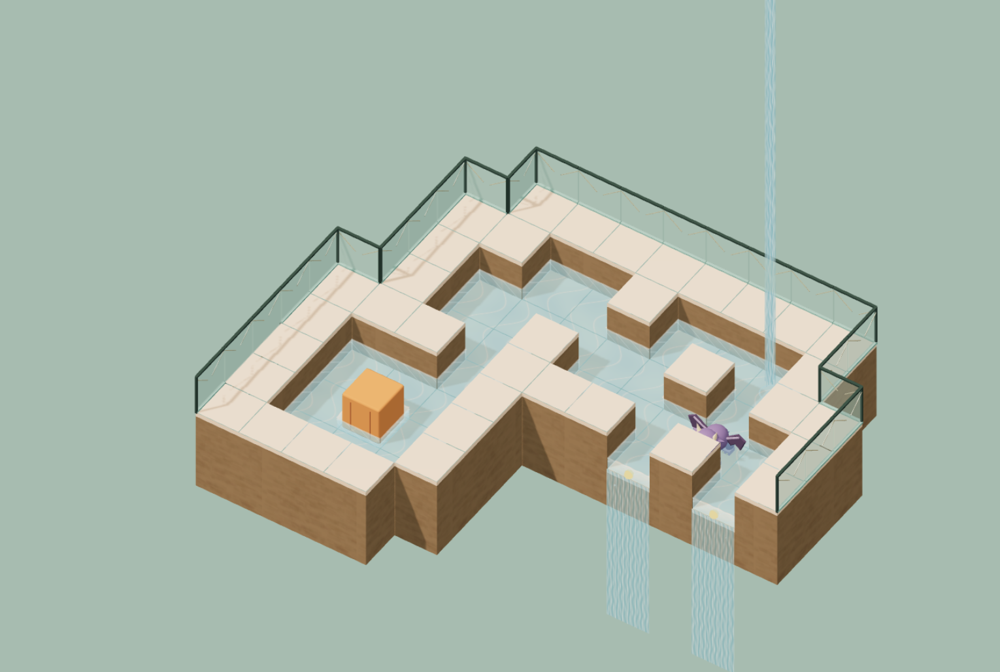

# 水之天堂 · Water Paradise



> 本项目是对 **Outpour** 原作的非商业复刻与移动端适配版。
> 原作 Steam 链接：[Outpour Demo](https://store.steampowered.com/app/4694840/Outpour_Demo/)

堆叠方块搭建多层空中庭院，引导天空水源穿过石桥、铁架与浮船，推动木箱、隔水拉取、借落水的力量开路——当全图只剩一条出水边，并亲自抵达它，庭院便告完成。

## 在线游玩

- **妙搭部署（移动端优化）**：https://4kzq9yhhpefpb.doubaoapps.com/app/app_17eru6egws1
- **GitHub Pages**：https://chenyehuan1234.github.io/water-paradise/

## 特性

- **34 关游戏正式关卡**，涵盖水流基础、物件实验、综合验证等章节
- **天平/平衡机制**：两端托盘可站立和放重物，较重一侧每次最多下降一档
- **移动端适配**：虚拟方向键、拉取/撤销/重开动作键、双指旋转缩放平移视角、局内选关侧栏、通关打勾、下一关入口
- **进度缓存**：自动记住上次玩的关卡和游戏进度，退出再进可继续
- **关卡编辑器**：堆叠建造、笔刷、矩形铺设、剖视、取样、导入导出
- Three.js + TypeScript + Vite，纯本地生成材质与模型，无外部 CDN 依赖

## 操作

| 平台 | 操作 |
| --- | --- |
| 桌面移动 | WASD / 方向键 |
| 桌面拉取 | 朝箱子挂上锁链后按空格 |
| 桌面撤销/重做/重开 | Z / Y / R |
| 移动端 | 屏幕底部虚拟方向键 + 动作按钮 |
| 视角 | 鼠标拖动旋转 / 滚轮缩放；手机单指旋转 / 双指平移缩放 |

胜利条件：全图恰好一条实际出水边，主角到达它所属的格子与水层。

## 本地开发

```bash
npm ci
npm run dev
```

构建：

```bash
npm run build
npm run preview
```

## 关于复刻

本项目为学习与个人兴趣目的的非商业复刻，游戏机制、关卡设计与美术风格致敬原作 Outpour（Steam: https://store.steampowered.com/app/4694840/Outpour_Demo/）。如原作作者认为侵权，请联系移除。
