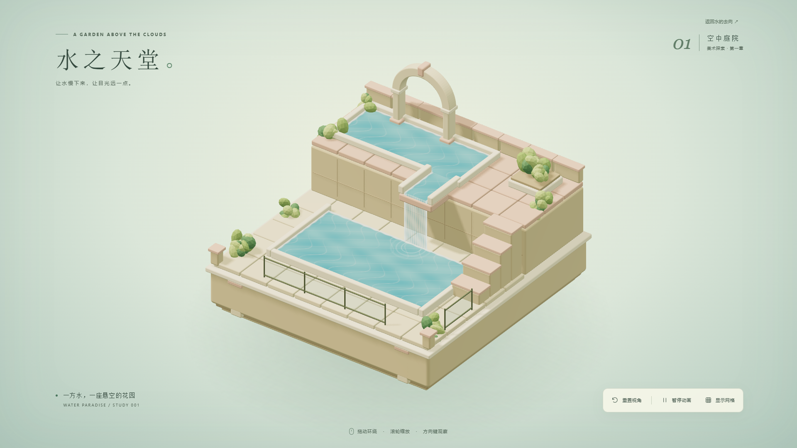
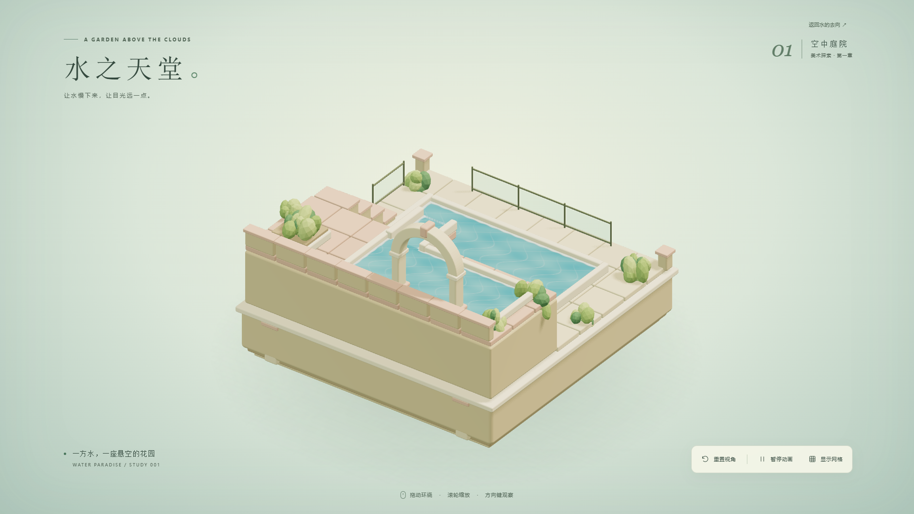
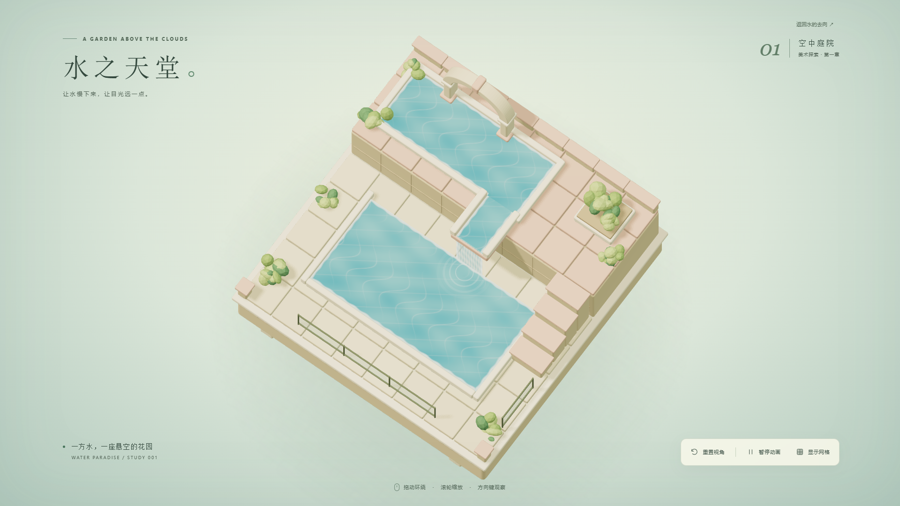

# 第一阶段验收记录

验收日期：2026-09-23。验收对象为本目录的独立工程，不涉及其他项目。

## 结果

- `npm run build` 通过，包含严格 TypeScript 类型检查；生产文件已生成在 `dist/`。
- Chrome 开发页面与 Edge 生产预览均通过 5 类浏览器场景，共 10 项检查。先完成基础 8 项，再补测 2 项 WebGL 不可用场景；最终辅助网格修正后定向复测了两个浏览器的完整交互场景。
- 正常打开、着色器编译和交互期间未发现页面运行异常或 console error。
- 默认、背面、高俯视、1366×768、小窗口、网格开启和不支持 WebGL 的截图保存在 `screenshots/`。

## 验收矩阵

| 项目 | Chrome 开发页 | Edge 生产预览 |
| --- | --- | --- |
| 场景加载与错误检查 | 通过 | 通过 |
| 1920×1080 默认、背面、高俯视截图 | 通过 | 通过 |
| 1366×768 构图及控制按钮可见 | 通过 | 通过 |
| 390×844 窄屏无横向溢出 | 通过 | 通过 |
| 鼠标环绕及 20°–70° 俯视约束 | 通过 | 通过 |
| 缩放上下限 0.72 / 1.65 | 通过 | 通过 |
| 重置精确恢复方位、俯视角和缩放 | 通过 | 通过 |
| 暂停时水体时间不变，恢复后继续推进 | 通过 | 通过 |
| 网格状态、显示 / 隐藏文本 | 通过 | 通过 |
| 方向键、R、Tab 焦点操作 | 通过 | 通过 |
| 减少动态效果默认暂停，可主动播放 | 通过 | 通过 |
| 图形上下文中断显示提示，重新打开恢复 | 通过 | 通过 |
| 禁用 WebGL 2 后显示中文错误和重试按钮 | 通过 | 通过 |

WebGL 禁用测试故意阻止图形上下文创建，因此会产生预期的引擎 console error；应用捕获失败，测试确认没有未处理异常，也不会留下空白画面或一直显示加载提示。

## 视觉检查

检查了默认、背面与高俯视截图：石材倒角和分缝清晰；台阶与平台高低差可见；水面与细框护栏没有明显透明排序闪烁或穿插。背面为完整实体，无未封闭的模型。顶部水池与水槽连接处已消除横跨开口的泡沫线。

调整了首版偏亮的光照，使陶粉与青蓝更容易辨认；去除过硬的背景投影，以柔和悬空阴影保留轻盈感。上层辅助网格使用真正的 1 单位间距，未通过缩放方形网格压缩格子。

## 性能记录

环境：Windows，NVIDIA GeForce RTX 5070 Laptop GPU，ANGLE Direct3D 11，1920×1080，设备像素比 1，默认视角、水体动画开启。

预热后每秒采样一次，共 10 秒，采样值是过去约 1 秒内实际渲染循环的平均帧率。

| 浏览器 | 模式 | 10 个采样值范围 | 平均值 | 正常帧绘制调用 | 三角形 |
| --- | --- | --- | --- | --- | --- |
| Chrome 153.0.8010.53 | Playwright headless / 开发服务 | 200–200 FPS | 200 FPS | 109 | 49,662 |
| Edge 153.0.4234.48 | Playwright headless / 生产预览 | 200–200 FPS | 200 FPS | 109 | 49,662 |

原始记录：[Chrome](chrome-dev-performance.json)、[Edge](edge-preview-performance.json)。这些结果来自本机有硬件加速的无头浏览器，表示此环境下超过 60 FPS 目标，不代表所有设备或实际显示器均能达到 200 FPS。移动真机、集成显卡及高 DPI 设备还未专项测量。

优化：重复地砖与植物采用实例化；静态场景的阴影只生成一次，将正常帧绘制调用由首版 194 降至 109。水流动画不改变投影几何，画面效果保持一致。

## 交付与边界

本地展示、源代码、锁定依赖、生产构建、美术规范、技术文档和截图均已交付。本阶段没有游戏规则、玩家、可推动物体、胜利判定、关卡编辑器或公开部署。

当前构建会提示单个 JS 包超过 500 kB，实际约 615 kB / gzip 157 kB；不影响构建或打开。没有为消除提示而人为拆包，后续编辑器与其他非首屏功能应按需加载。

上述是工程与视觉自检；最终美术方向仍以用户查看样板后的意见为准，后续阶段尚未开始。
